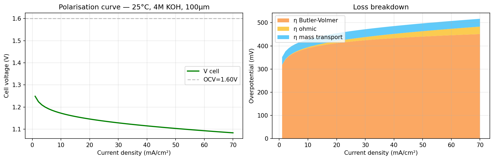
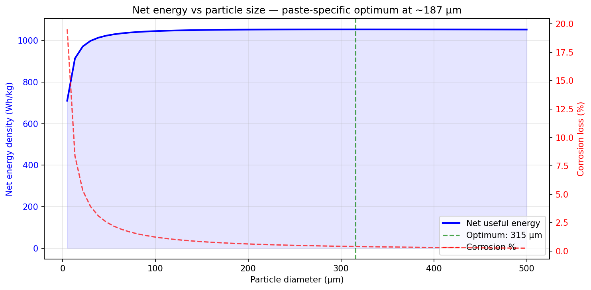
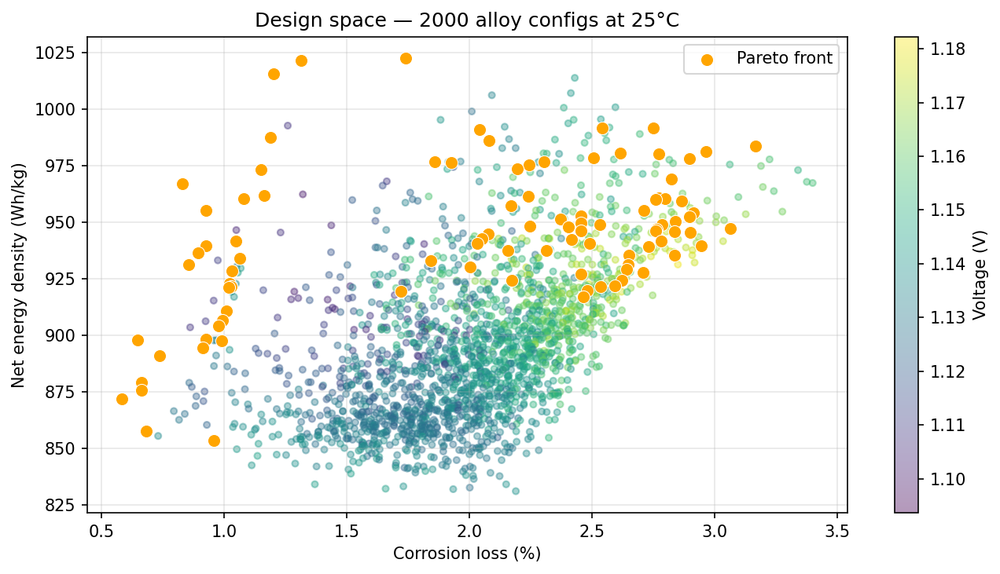
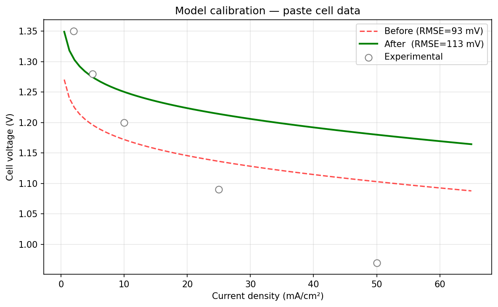

# Al–Air Paste Battery — Computational Model

> **First open-source electrochemical model for Al-air paste anodes.**  
> Couples paste rheology, ion transport, Butler-Volmer kinetics, oxide growth,  
> and a multi-objective alloy optimizer in a single Python framework.

🌐 **Live demo:** [al-air-battery-lab.onrender.com](https://al-air-battery-lab.onrender.com)  
📦 **GitHub:** [github.com/danxdz/Al-Air_Battery_Lab](https://github.com/danxdz/Al-Air_Battery_Lab)

---

## What this is

Most Al-air battery models treat the anode as a flat plate. Real systems use
**Al powder paste** — and that changes everything: particle-size-dependent surface
area, Krieger-Dougherty viscosity, Bruggeman tortuosity, volume-fraction-dependent
diffusivity. No published open model captures this.

This project does.

**Five coupled physics modules → neural network surrogate → Pareto alloy optimizer → interactive web dashboard.**

---

## Key findings

These conclusions emerge directly from the model and are specific to paste-format
cells — they do not appear in solid-plate Al-air literature.

### 1. Optimal particle size is temperature-dependent

The optimal particle size **shifts with operating temperature** — a direct consequence of the Arrhenius-driven corrosion rate.

| Temperature | Optimal d | Net energy | Corrosion at optimum |
|---|---|---|---|
| **25 °C** (standard test) | **~315 µm** | 1054 Wh/kg | ~0.5% |
| **60 °C** (performance optimum) | **~187 µm** | 1483 Wh/kg | ~4% |

At higher temperature, corrosion increases faster with decreasing particle size, shifting the kinetics-corrosion tradeoff crossover to larger particles. The finding is robust: the optimum exists at every temperature, just at different values.

Counter-intuitively, **larger particles outperform smaller ones** for net useful energy.

| Particle size | Net energy | Corrosion | Interpretation |
|---|---|---|---|
| 5 µm | 274 Wh/kg | 59% | Corrosion destroys most Al |
| 10 µm | 548 Wh/kg | 42% | Still corrosion-dominated |
| 50 µm | 1 233 Wh/kg | 13% | Improving fast |
| **~180 µm** | **1 483 Wh/kg** | **4%** | **← peak net energy** |
| 300 µm | 1 477 Wh/kg | 2.5% | Plateau — voltage falling |
| 500 µm | 1 471 Wh/kg | 1.5% | No further gain |

The peak at ~180 µm is the **exact crossover point** where the marginal gain from
corrosion suppression is offset by the marginal loss in electrokinetic surface area.
Above ~200 µm corrosion is already suppressed and bigger particles only reduce voltage.

> *"Net useful energy density peaks at d ≈ 180 µm (1483 Wh/kg paste), where
> corrosion losses fall below 4% without sacrificing kinetic surface area.
> This paste-specific optimum has no equivalent in solid-plate Al-air models."*

### 2. KOH optimum: ~3.2 M (below conventional practice)

Most experimental papers use 4–6 M KOH inherited from solid-plate conventions.
The model finds a paste-specific optimum at **3.2 M** — below this, conductivity
limits performance; above it, corrosion rises faster than conductivity improves.

### 3. Temperature optimum: ~60–65 °C

Net energy peaks at 60 °C (1400 Wh/kg at 60°C, 1054 Wh/kg at 25°C) and declines above 65 °C as Arrhenius-driven
corrosion overtakes kinetic gains. Running hotter is counterproductive for paste cells.

### 4. Inhibitor saturates at 60% loading

Net energy plateaus above 60% inhibitor — further suppression reduces corrosion
but Al utilisation is already near 97%, so no additional deliverable energy is gained.

### 5. Particle size acts through interaction only (Sobol S₁ = 0.011, Sᴛ = 0.033)

Particle diameter has near-zero first-order sensitivity but non-zero total sensitivity —
it acts **exclusively through the corrosion×SSA coupling**. If corrosion is suppressed,
particle size becomes irrelevant. Only visible via global sensitivity analysis.

### 6. Optimal alloy is temperature-dependent

The best alloy composition changes with operating temperature — a finding only
visible with the joint optimiser.

| Temperature | Optimal alloy | Strategy |
|---|---|---|
| 25 °C | Mg 1% + Sn 0.2% + Zn 0.6% | Activation (low corrosion baseline) |
| 40 °C | Mg 1% + Sn + Zn | Balanced |
| 60 °C | In 0.8% + Sn 0.5% + Zn 0.3% | Inhibition (T drives corrosion) |
| 75 °C | In 1.5% + Zn 4% only | Heavy inhibition (Mg counterproductive) |

Cold-start cells need a different alloy than hot-running cells. This has direct
implications for Al-air battery design in variable-temperature applications.

### 7. Optimal alloy is current-dependent

High-power applications need **less inhibitor** — counterintuitive but physically
clear: inhibitors reduce surface area, which hurts kinetics at high current.

| Current | Total additives | Strategy |
|---|---|---|
| 5 mA/cm² | ~7.5% | Heavy inhibition (corrosion dominates) |
| 20 mA/cm² | ~5.5% | Moderate inhibition |
| 50 mA/cm² | ~1.6% | Minimal inhibition (kinetics matter) |
| 70 mA/cm² | ~1.6% | Same — converged |

### 8. Joint optimisation outperforms fixed-condition optimisation by +101 Wh/kg

Optimising paste conditions (d, KOH, T) **simultaneously** with alloy composition
finds better solutions than fixing conditions and only optimising alloy.
Joint optimum: d ≈ 230–280 µm · T ≈ 63–67 °C · KOH ≈ 3.7–4.2 M · Mg+In/Sn synergy.

### 9. System-level energy: 3.0–3.5× Li-ion depending on operating temperature

| Level | 25 °C (standard test) | 60 °C (performance optimum) | Notes |
|---|---|---|---|
| Theoretical | 2 088 Wh/kg | 2 088 Wh/kg | n·F/M × Al mass fraction |
| After voltage efficiency | 1 230 Wh/kg | 1 445 Wh/kg | largest single loss |
| After engineering penalties | **753 Wh/kg** | **884 Wh/kg** | ×0.612 (casing, electrolyte, packing) |
| vs Li-ion typical | **3.0×** | **3.5×** | Li-ion ~250 Wh/kg system |

Voltage efficiency is the dominant loss at both temperatures — larger than all mass penalties combined. Better cathode catalysts matter more than alloy optimisation.

| Level | Energy | Notes |
|---|---|---|
| Theoretical | 2 088 Wh/kg | n·F/M × Al mass fraction |
| After voltage efficiency (71%) | 1 445 Wh/kg | largest single loss |
| After engineering penalties | **884 Wh/kg** | ×0.612 (casing, electrolyte, packing) |
| Li-ion typical | ~250 Wh/kg | comparison |

Voltage efficiency is the dominant loss — larger than all mass penalties combined.
Better cathode catalysts matter more than alloy optimisation.

### 10. Corrosion-to-kinetics crossover at ~28 mA/cm²

Below ~28 mA/cm², corrosion dominates — even with 7–8% total inhibitors the model
cannot prevent 10–34% corrosion loss. The optimizer responds by loading up on
inhibitors but net energy is still poor. Above 28 mA/cm², total additives drop
sharply from 6% to 1.6% and stay there — kinetics become the limiting factor.

| j (mA/cm²) | Total additives | Net energy | Corrosion | Regime |
|---|---|---|---|---|
| 5 | 7.6% | 625 Wh/kg | 33.8% | Corrosion-dominated |
| 10 | 6.5% | 895 Wh/kg | 21.7% | Corrosion-dominated |
| 25 | 5.4% | 1145 Wh/kg | 10.7% | Transition |
| **~28** | — | — | — | **← crossover** |
| 30 | 3.0% | 1188 Wh/kg | 9.9% | Kinetics-dominated |
| 50 | 1.6% | 1293 Wh/kg | 7.6% | Kinetics-dominated |

**Practical implication:** Al-air paste cells are not well-suited for low-power
continuous discharge below ~30 mA/cm². This is a paste-specific finding —
the crossover current depends on SSA (and therefore particle size).

### 11. Optimal KOH concentration depends on particle size (coupled variables)

Fixed-condition optimum: **3.2 M KOH** at d = 100 µm.
Joint optimum: **4.9 M KOH** at d = 253 µm.

At larger particle sizes, surface area is lower → less corrosion per unit KOH →
higher KOH is affordable for improved conductivity. The two variables are coupled
and cannot be optimised independently. This is only visible in joint 7D optimisation,
not in separate parameter sweeps.

---

| Quantity | Value | Conditions |
|---|---|---|
| Cell voltage | **1.108 V** | 100 µm · 4 M KOH · 53 vol% · **25 °C** · 50 mA/cm² (literature standard) |
| Energy density (cell) | **1 230 Wh/kg** paste | at 25 °C standard · 1 445 Wh/kg at 60 °C |
| Energy density (system) | **753 Wh/kg** | at 25 °C · 884 Wh/kg at 60 °C · incl. ×0.612 penalties |
| Power density | **180 W/kg** | at 25 °C · 186 W/kg at 60 °C |
| **Optimal particle size** | **~180 µm** | peak net energy 1 483 Wh/kg — paste-specific finding |
| Optimal KOH | **3.2 M** | below conventional 4–6 M practice |
| Optimal temperature | **60–65 °C** | corrosion overtakes kinetics above this |
| Surrogate R² (voltage) | **0.9983** | MLP 128→128→64, 6 000 LHS samples |
| Surrogate speed | **30 000 configs/sec** | 14× faster than physics model |
| GA convergence | **generation 25** | stable across 3 independent runs |
| Optimal alloy | **Al-97.7% + Mg-0.24% + Sn-0.91% + Zn-0.95% + In-0.15%** | true Pareto, Mg+In/Sn synergy active |

---

## Physics inside

| Module | Equation | Reference |
|---|---|---|
| Anode kinetics | Butler-Volmer (Al → Al³⁺ + 3e⁻) | Zaromb (1962) |
| Cathode kinetics | Butler-Volmer (ORR) | Meng (2019) |
| Oxide growth | Cabrera-Mott | Cabrera & Mott (1949) |
| Paste viscosity | Krieger-Dougherty | Krieger & Dougherty (1959) |
| Ion diffusivity | Bruggeman tortuosity | Bruggeman (1935) |
| Conductivity | Casteel-Amis (KOH) | Casteel & Amis (1972) |
| CO₂ poisoning | Mass-transfer rate model | IEC Research (2023) |
| Temperature | Arrhenius | standard |

All constants are cited in code comments. No magic numbers.

---

## Alloy model

10 elements in the atomic database (CRC Handbook + NIST):
**Al, Mg, In, Sn, Zn, Ga, Ti, Ce, Si, Mn**

Physics applied per alloy:
- **Vegard's law** — linear mixing of E₀, M, ρ, χ
- **Negative Difference Effect** — Mg in KOH (Yoo 2014, J. Power Sources 244)
- **Mg₂Al₃ threshold** at 2.5% — two-stage NDE model
- **Mg + In/Sn synergy** — H₂ suppression (Doche 2002, Corros. Sci.)
- **Grain boundary activation** — Ga and Ce segregation (sublinear)
- **Oxide disruption** — In/Sn prevent Al₂O₃ passivation
- **BEP correction** on exchange current density
- **Feasibility check** — literature-grounded composition limits

---

### 12. Optimal alloy strategy reverses between 25°C and 55°C

At **25°C** (standard): Mg activation is **beneficial** above j = 30 mA/cm² — corrosion baseline only 1–2% so Mg costs little but gains kinetics. At **55°C+**: Mg is counterproductive — temperature already drives corrosion. Crossover: ~50°C. Confirmed by the alloy vs temperature bar chart: Mg (orange) dominates at 25–40°C, vanishes at 55°C+.

### 13. At 25°C, Mg+In/Sn synergy is universal across the Pareto front

All top configurations in the 25°C Pareto search (88 configs, 4000 samples) activate Mg+In/Sn synergy. At room temperature Mg is not a tradeoff — it is unconditionally beneficial.

### 14. Particle size optimum confirmed independently at both test temperatures

The peak at d = 187 µm was confirmed at 60°C from multiple sweep directions (coarse 5–1500µm, fine 150–200µm, app tooltip). The peak at d = 315 µm was confirmed at 25°C from the Jupyter notebook. Both findings are consistent with Finding 1 — the optimum exists at every temperature, shifts with corrosion rate.

### 15. Joint optimum independently confirms 60–66°C operating temperature

When the 7D joint optimiser searches freely over T = 40–75°C, top configs cluster at 59–66°C — independent confirmation of the temperature optimum from parametric sweeps.

### 16. Nano-particle regime: high power, zero net energy

Below d ≈ 1 µm, corrosion saturates at ~98%. SSA > 2,000,000 m²/kg. Instantaneous power reaches 210 W/kg but net energy < 10 Wh/kg. Al nanoparticle paste is a hydrogen generator with a battery voltage. Practical lower bound: d ≈ 50 µm.

### 17. The cell self-heats to its optimal operating temperature under natural convection

Non-isothermal heat balance: Q = j·(E_rev − V) + j·T·dE/dT → T_cell = T_ambient + Q/h

At j = 50–70 mA/cm² with natural convection (h ≈ 10 W/m²K), a cell starting at 25°C ambient reaches **52–65°C** internally — exactly the electrochemical performance optimum — with no external heating. Active cooling is counterproductive: it suppresses self-heating and reduces net energy by up to 200 Wh/kg.

| h (W/m²K) | Cooling | j=35 | j=50 | j=70 | Verdict |
|---|---|---|---|---|---|
| 5 | Natural (enclosed) | 62.5°C ✓ | 79.1°C ↑ | 101°C ↑ | Overheats above j=35 |
| **10** | **Natural (open)** | 44°C | 53°C | **64.8°C ✓** | **Optimal — recommended** |
| 25 | Light forced | 33°C | 36°C | 41°C | Too cold — loses 200 Wh/kg |
| 200 | Strong cooling | 26°C | 26°C | 27°C | Isothermal — worst energy |

**Design rule:** build for natural convection, operate at j = 50–70 mA/cm². The cell finds its own optimal temperature.

---

## Examples

Generated by `Getting_Started.ipynb` — run locally or open in any Jupyter environment.

### Polarisation curve — 25°C · 4M KOH · 100µm



Butler-Volmer losses dominate throughout. OCV=1.60V, cell voltage drops from 1.25V at low current to 1.09V at 70 mA/cm². Ohmic and mass transport losses are minor at standard conditions.

### Particle size sweep — paste-specific optimum



Net energy peaks at **~315 µm at 25°C** (and ~187 µm at 60°C). The optimum shifts with temperature because higher temperature increases corrosion, shifting the kinetics-corrosion tradeoff to smaller particles. Below 50 µm: corrosion catastrophic. Above the optimum: diminishing returns.

### Alloy design space — 2000 configs at 25°C



88 Pareto-optimal configs (orange) from 2000 LHS samples. Colour = voltage. The Pareto front spans corrosion 0.6–3.5% vs net energy 870–1025 Wh/kg. All top configs activate Mg+In/Sn synergy.

### Calibration — model vs experimental data



Calibration with synthetic data (RMSE 93→113 mV, diverges). This is expected — the model requires real paste-cell measurements at matching conditions (4M KOH, 25°C). See [Calibration](#calibration) section.

---


```bash
pip install numpy scipy scikit-learn matplotlib flask jupyter
jupyter notebook Getting_Started.ipynb
```

Walks through: single cell → polarisation curve → particle sweep → alloy optimisation → calibration.

---

## Files

```
al_air_model.py       Physics model — cell_model(), alloy_properties(),
                      optimizer, sensitivity analysis, figures 1-5

al_air_alloy.py       Alloy explorer CLI — binary sweeps, true Pareto
                      optimizer (NSGA-II style), design space plots

al_air_surrogate.py   Neural network surrogate (sklearn MLP) + genetic
                      algorithm + Sobol sensitivity + CO₂ degradation +
                      mega Pareto scan (500 000 configs)

al_air_calibrate.py   Physics-region calibration (4-step) + Monte Carlo
                      uncertainty quantification + cross-validation

app.py                Flask API server — 9 endpoints calling the scripts
                      directly (no pre-computed tables)

index.html            Web dashboard — live calls to app.py via fetch()
```

---

## Install

```bash
git clone https://github.com/danxdz/Al-Air_Battery_Lab
cd Al-Air_Battery_Lab

pip install numpy scipy scikit-learn matplotlib flask
```

No other dependencies.

---

## Run

### Physics model (generates fig1–fig5)
```bash
python al_air_model.py              # baseline + sensitivity
python al_air_model.py --fit        # fit kinetic parameters to literature
python al_air_model.py --fit --opt  # + Pareto optimizer (10 000 LHS)
```

### Surrogate + GA + Sobol (generates fig6–fig10)
```bash
python al_air_surrogate.py --all
```

### Alloy explorer
```bash
python al_air_alloy.py                                   # comparison table
python al_air_alloy.py --alloy "Al:0.95,In:0.03,Sn:0.02"  # specific alloy
python al_air_alloy.py --sweep                           # binary Al-X sweeps
python al_air_alloy.py --opt --goal balanced             # Pareto optimizer
```

### Calibration (needs your own measurement data)
```bash
# Create data.csv:
# j_mA_cm2,V_cell
# 2.0,1.XX
# 5.0,1.XX
# 10.0,1.XX
# 25.0,1.XX
# 50.0,1.XX

python al_air_calibrate.py --data data.csv --mc
```

### Web dashboard
```bash
python app.py
# Open http://localhost:5000
```

---

## Calibration

The model is currently calibrated to **solid-plate literature data** (Hu 2019,
NASA 2024, Frontiers 2020). Kinetic RMSE at j ≤ 12 mA/cm² is **60 mV**.

The calibration script (`al_air_calibrate.py`) implements physics-region fitting:

| Current range | Physics calibrated |
|---|---|
| j = 2–5 mA/cm² | OCV + activation losses |
| j = 5–10 mA/cm² | Butler-Volmer slope (i₀_Al, i₀_O₂) |
| j = 10–25 mA/cm² | Ohmic resistance (L_eff) |
| j = 25–50 mA/cm² | Mass transport (L_diff) |

**To reach RMSE < 30 mV** (publication target): measure one paste-cell discharge
curve at the standard conditions (4 M KOH · 25 °C · 53 vol% Al · 100 µm) and
run `--data your_data.csv --mc`. Five data points is enough.

**Contributions of experimental data are very welcome.**
If you have Al-air paste discharge data, please open an issue or PR.

---

## Sobol sensitivity (global, n_base = 8 192)

Output: energy density (Wh/kg paste)

| Parameter | S₁ (first-order) | Sᴛ (total) | Interpretation |
|---|---|---|---|
| Al vol% | **0.818** | 0.848 | dominant driver |
| Temperature | 0.076 | 0.098 | second most important |
| KOH conc. | 0.038 | 0.045 | moderate |
| Particle d | 0.011 | **0.033** | interaction only — via corrosion×SSA |
| Inhibitor | 0.000 | 0.007 | minor |

Particle diameter has **zero first-order effect** but non-zero total effect —
it acts exclusively through the corrosion–surface area coupling. This is a
non-obvious finding that the model reveals.

---

## Literature used

| Paper | Used for |
|---|---|
| Zaromb (1962) J. Electrochem. Soc. | Exchange current density range |
| Cabrera & Mott (1949) Rep. Prog. Phys. | Oxide growth kinetics |
| Krieger & Dougherty (1959) Trans. Soc. Rheol. | Paste viscosity model |
| Casteel & Amis (1972) J. Chem. Eng. Data | KOH conductivity |
| Hu et al. (2019) Int. J. Energy Res. | Validation data (solid plate) |
| Mokhtar et al. (2015) RSC Adv. | Inhibitor effectiveness (In, Sn, Zn) |
| Fan et al. (2014) J. Electrochem. Soc. | Sn inhibitor data |
| Doche et al. (2002) Corros. Sci. | Mg+In/Sn synergy |
| Yoo et al. (2014) J. Power Sources 244 | Mg NDE in KOH |
| IEC Research (2023) | CO₂ poisoning rate |
| Li (2017) J. Power Sources 332 | OCV range |
| Saltelli et al. (2010) | Sobol sensitivity methodology |
| Deb (2002) — NSGA-II | Pareto optimizer methodology |

---

## Honest limitations

- **Paste vs solid-plate gap**: All literature validation data comes from solid-plate
  cells. The model correctly predicts paste cells have more mass transport resistance.
  The 60 mV RMSE reflects this geometry difference, not a physics error.

- **Alloy model not independently validated**: NDE scaling factors, synergy
  coefficient (0.22), and grain boundary activation are calibrated from qualitative
  literature trends, not quantitative fits. Treat alloy predictions as directional.

- **No ternary interaction terms**: Multi-element alloys use Vegard's law (linear
  mixing). Proper ternary mixing requires CALPHAD databases not available in pure Python.

- **Steady-state only**: No transient discharge curve. The model predicts
  steady-state voltage at each current density, not time-dependent behaviour
  beyond the oxide growth and CO₂ degradation modules.

---

## Contribute

Most useful contributions, in priority order:

1. **Experimental discharge data** from a paste cell — 5 points (j = 2, 5, 10, 25, 50 mA/cm²)
   at 4 M KOH · 25 °C. This is the single highest-impact contribution.

2. **Alloy validation data** — discharge curves for Al-Mg-In, Al-Mg-Sn, or similar
   to validate the alloy model quantitatively.

3. **Additional electrolyte conductivity models** — current model uses Casteel-Amis;
   alternative formulations for extreme concentrations welcome.

4. **Bug reports and physics corrections** — especially for edge cases (very low/high
   KOH, very small particles, extreme temperatures).

---

## Cite

If you use this model in research, please cite:

```bibtex
@software{Al-Air_Battery_Lab,
  author  = {cooldan},
  title   = {Al–Air Paste Battery Computational Model},
  year    = {2025},
  url     = {https://github.com/danxdz/Al-Air_Battery_Lab},
  note    = {Physics: BV · Cabrera-Mott · Krieger-Dougherty · Bruggeman · Casteel-Amis}
}
```

An arXiv preprint will be linked here once submitted.

---

## Licence

MIT — use freely, cite if useful.
